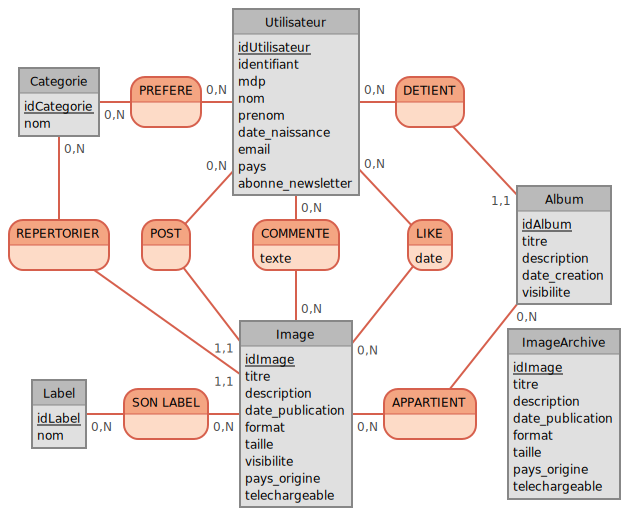

# MODELISATION  

## Schéma relationnel 

## Contraintes d'intégrité 

### Utilisateur 
- **idUtilisateur** est la clé primaire de la table elle ne doit pas être nulle et non modifiable.
- **identifiant** qui est le login de la personne doit être unique dans la base de données. 
- **mdp** le mot de passe doit pas être vide et doit avoir minimum 8 caractères avec des caractères spéciaux. 
- **nom** et **prenom** sont obligatoires. 
- **date_naissance** doit avoir un format valide. 
- **email** format valide et unique 
- **Pays** non vide et valide 
- **abonne_newsletter** un booléan pour indiquer s'il est abonné, par defaut 0. 

### Image 

- **idImage** est la clé primaire de la table elle ne doit pas être nulle et non modifiable.
- **titre** doit pas être vide 
- **date_publication** format valide et doit pas être superieur à la date du système
- **format** valide et non vide.  
- **taille** superieur à 0.
- **visibilite** par defaut privé.
- **pays_origine** valide.
- **telechargeable** booléan par defaut 0. 

### ImageArchive

- **idImage** est la clé primaire de la table elle ne doit pas être nulle et non modifiable.
- **titre** doit pas être vide 
- **date_publication** format valide et doit pas être superieur à la date du système
- **format** valide et non vide.  
- **taille** superieur à 0.
- **visibilite** par defaut privé.
- **pays_origine** valide.
- **telechargeable** booléan par defaut 0. 

### Album 
- **idAlbum** est la clé primaire de la table elle ne doit pas être nulle et non modifiable.
- **titre** doit pas être vide. 
- **date_creation** format valide et doit pas être superieur à la date du système. 
- **visibilite** par defaut privé.

### Categorie
- **idCategorie** est la clé primaire de la table elle ne doit pas être nulle et non modifiable.
-- **nom** doit pas être vide et il est unique dans la table 

### LABEL
- **idLabel** est la clé primaire de la table elle ne doit pas être nulle et non modifiable.
-- **nom** doit pas être vide et il est unique dans la table 

## Modèle relationnel 
- **UTILISATEUR**( <u>idUtilisateur</u> : Integer, identifiant : String, mdp : String, nom: String, prenom : String, date_naissance : Date,email : String, pays : String, abonne_newsletter : Bool ).

- **IMAGE**( <u>idImage</u> : Integer, #idUtilisateur : Integer, #idCategorie : Integer titre : String, description : String, date_publication :  Date, format : String, taille : Integer, visibilite : Boolean, pays_origine : String, telechargeable : Boolean ).

- **ALBUM**( <u>idAlbum</u> : Integer, #idUtilisateur : integer, titre : String, description : String, date_creation : Date, visibilite : Boolean ).

- **LABEL** ( <u>idLabel</u> : Integer, nom : String ).
- **CATEGORIE** ( <u>idCategorie</u> : Integer, nom : String ).

- **IMAGEARCHIVE**( <u>idImage</u> : Integer, #idUtilisateur : Integer, #idCategorie : Integer titre : String, description : String, date_publication :  Date, format : String, taille : Integer, visibilite : Boolean, pays_origine : String, telechargeable : Boolean).

- PREFERE ( #idUtilisateur, #idCategorie )
- DETIENT ( #idUtilisateur, #idAlbum )
- REPERTORIER ( #idCategorie, #idImage )
- POST ( #idUtilisateur, #idImage )
- COMMENTE ( #idUtilisateur, #idImage, texte : String )
- LIKE ( #idUtilisateur, #idImage, date : Date )
- SON_LABEL ( #idImage, #idLabel )
- APPARTIENT ( #idAlbum, #idImage )

